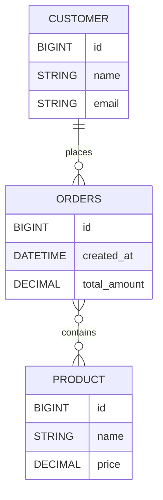

# Challenge day

## Repository
https://github.com/Guybrush3791/boolean-uk-1-fortnox-springboot-sso-protected-res.git

## Learning Objectives

- _SSO auth_ through self-hosted _Keycloak_
- Identiy Provider and authentication
- SpringBoot Security

## Instructions

1. Fork this repository
2. Clone your fork to your machine
3. Open the project in _IntelliJ_
4. Copy `application.yaml.example` to `application.yml` and fill out your _database_ and _security_ connection details
5. Check that `build.gradle` contains the correct dependencies and rerun gradle sync to make it all update

## Activities
### Core
##### Entities
The reality is an *e‑commerce order flow* where a `Customer` places `Orders` that contain `Products`.

##### Database Seeding
Once you created database through *Hibernate*, start seeding table either through *flyway*, *SQL query* or *Hibernate* in order to have at least:
- 5 `Products`
- 3 `Customer`
- 3 `Orders` made by 2 different `Customers`

##### API
Give to the user the following *API* end-points

###### Public
- **GET** all `Products`
- **GET** `Product` by id
- **CREATE** new `Order`
- **CHANGE** an `Order`

###### Private
- complete CRUD on `Customer`
- complete CRUD on `Order`
- complete CRUD on `Product`
- **GET** value of each `Customer` (sum of order price by `Customer`)
- **GET** product along with number of sell
- **GET** all orders with full value, ordered by value

###### OpenAPI
Provide the *OpenAPI* documentation for each end point implemented

##### Authentication
*IdP* is internal self-hosted *Keycloak* with dedicated *realm*

**Realm name** `booleanuk-sso-challenge-day`

### Extension

Explore the possibility to introduce the *rule* concept into the *authentication* process and create 2 kind of user:
- **USER** this user can access at all *CRUD private API*, but can't access to the *statistic* informations (the last 3 private API)
- **ADMIN** this user can access everything
